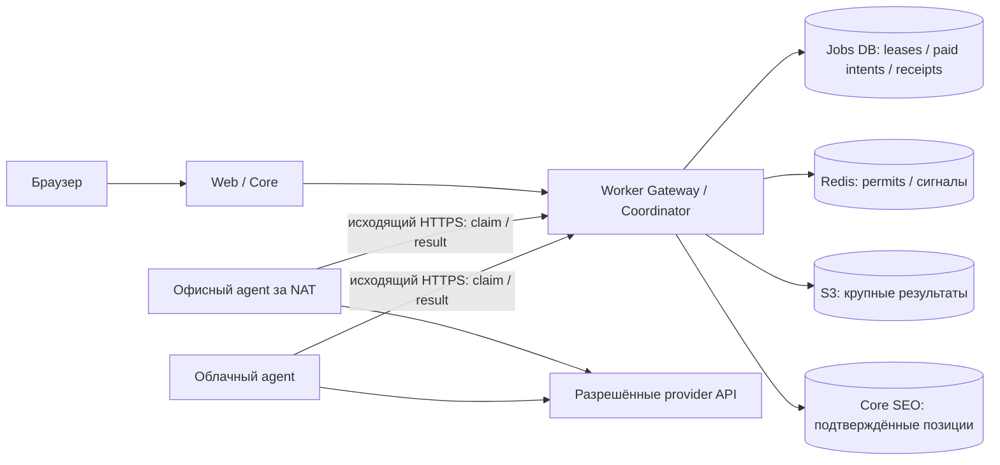

# ADR-2026-051: распределённый пул execution-воркеров

- Статус: предлагается; **архитектура, не реализовано**
- Дата: 29 сентября 2026 года
- Владелец решения: продукт/платформа
- Затронутые области: Execution Jobs, коннекторы, Core SEO, credential vault,
  биллинг, Redis Jobs, объектное хранилище, admin, инфраструктура
- Изменение API/БД при будущей реализации: versioned Worker API и
  дополнительные Jobs-owned записи узлов, назначений и receipts. Границы
  владения `platform_db`/`seo_db`/`jobs_db` не меняются.

## 1. Цель и границы

Масштабировать исполнение позиций, Wordstat, выдачи конкурентов, импорта,
экспорта и других долгих операций на офисные и облачные машины. Офисной машине
не требуется входящий публичный IP или домен. Главный Compose остаётся
управляющим контуром: он создаёт Jobs, выбирает исполнителя, ограничивает
платные провайдеры, принимает результаты и хранит authoritative state.
Продуктовая цель — обслуживать до 100 одновременно идущих съёмов при наличии
достаточного числа доверенных воркеров. Frontend, PostgreSQL и основная очередь
остаются на главном сервере 8 CPU / 16 ГБ; допустимые ступени его усиления —
12/24 или 16/32. Цель 100 съёмов не равна обещанию каждому из 100 ключей
полного provider maximum до нагрузочного подтверждения.

Это решение **не** означает один OS-процесс/контейнер на пользователя или Job.
Долгоживущий agent на каждом узле исполняет несколько ограниченных асинхронных
work units. Одна большая операция может делиться между несколькими узлами;
неделимые операции остаются на одном узле с checkpoint.

Цель сохранности: исчезновение одного воркера, включая уничтожение его диска,
не удаляет операцию и **все подтверждённые центром** позиции, файлы и receipts.
Неподтверждённые единицы работы назначаются заново. Если платный ответ
провайдера был только в памяти исчезнувшего воркера, сохранить именно эти
байты невозможно; применяется ограниченный автоповтор с явным учётом риска
повторной оплаты. Работа никогда не исчезает молча.

Не входит в этот этап: реализация, выбор облачного тарифа, автоматическое
создание VM, HA самого главного PostgreSQL и изменение пользовательских
лимитов XMLStock. Перед началом разработки нужен отдельный утверждённый план
миграции и нагрузочный бюджет.

## 2. Текущее состояние, которое нельзя ломать

- Сейчас `backend-execution` владеет Jobs/credential vault/брокерами,
  PostgreSQL является источником состояния операции, Redis/BullMQ — транспорт.
- Core SEO владеет immutable результатами позиций. Platform API владеет
  workspace, правами и деньгами. Воркер не обращается к их таблицам напрямую.
- Платный provider submit имеет durable may-have-started marker,
  estimate/reservation/settlement и fenced lease. Эти гарантии сохраняются.
- Физически одинаковые XMLStock-ключи в разных workspace делят один
  provider-safe лимит; разные ключи не должны мешать друг другу сверх общего
  ограничения инфраструктуры.
- Новый контур совместим с действующим центральным connector-worker на время
  поэтапной миграции. Переключение выполняется по capability/feature flag,
  без big-bang переноса всех операций.
- Черновик ADR-2026-050 описывает более ранние значения 12/24 lanes;
  перед принятием обоих решений его численные предпосылки нужно сверить с
  текущим production cap 64, не переносить в реализацию автоматически.

## 3. Выбранная топология



На главном сервере появляется Worker Gateway/Coordinator внутри владельца
Jobs (`backend-execution`). Он доступен снаружи **только** через отдельный
allowlisted HTTPS-маршрут reverse proxy. Нельзя публиковать PostgreSQL,
Redis, NATS, внутренний Jobs API или credential vault. Worker Compose содержит
agent и разрешённые process roles, но не PostgreSQL и не общую Redis-базу.
По выбору владельца Gateway совмещается с существующим Jobs HTTP process, а
не выделяется в ещё один процесс. Включаемая роль `BOTH` даёт этому процессу
право JIT-расшифровки BYOK и billing-settlement token. Это расширяет blast
radius компрометации HTTP process относительно отдельного Gateway; по
умолчанию роль остаётся `MANAGEMENT`, а внешний `/worker/v1/*` закрыт.
PostgreSQL, Redis/BullMQ и NATS JetStream остаются физически на главном
сервере в первой версии. Существующий локальный execution worker также
регистрируется в планировщике как специальный `main-local` узел.
На каждом офисном ПК достаточно Docker Compose и способа получить подписанный
release image; Dokploy на каждом ПК необязателен. В будущем Dokploy либо CI/CD
может обновлять agent после `drain`, но не исполняет произвольные shell-команды
из admin UI.

### Соединение при NAT/динамическом IP

Worker **сам открывает** исходящее TLS-соединение к Worker Gateway и делает
долгое `claim`/long-poll (до 20–30 секунд); каждые ~10 секунд посылает
heartbeat. Главный сервер решает, какую work unit вернуть этому запросу.
Входящее соединение к офисному ПК, reverse proxy на нём и проброс портов
не нужны. При обрыве сети agent переподключается с backoff и не начинает
новые платные запросы без центрального разрешения. WebSocket можно добавить
для быстрых команд `drain/reconfigure`, но source of truth и получение работы
остаются HTTP/DB, а не WebSocket.

## 4. Состояние и данные

Локальная БД воркера **не является источником истины**. Она не подходит для
требования «ПК полностью исчез, но ничего не потерялось». В первой версии
локальной БД вообще нет: только bounded память и временные файлы для
потоковой обработки. Опциональный зашифрованный spool позже может пережить
краткий обрыв связи при живом ПК, но его потеря не должна менять итог.

Главное хранилище остаётся разделённым по существующим owners:

| Данные | Владелец | Когда считать подтверждёнными |
|---|---|---|
| Job, work unit, назначение, lease, платный старт, usage receipt | `jobs_db` | после DB commit |
| Позиция, SERP/частотность, immutable snapshot | Core SEO / `seo_db` | после ingest receipt |
| Workspace, права, биллинг и резерв | Core API / `platform_db` | после policy/ledger commit |
| Крупный файл/чанк результата | S3-compatible storage | после checksum + DB pointer/receipt |

Для больших SERP/export-чанков Gateway заранее записывает ожидаемый
immutable object key в Jobs DB и выдаёт подписанный URL на **один
неизменяемый объект** и короткое время. Воркер не получает S3 access key.
Ключ уникален для attempt, повторное использование URL для другого payload
запрещено; checksum и условная запись без overwrite проверяются на выбранном
S3-compatible storage.
Он загружает байты с checksum, после чего центр проверяет размер/hash/scope,
фиксирует receipt и только затем отвечает ACK. Если узел исчез после upload,
но до ACK, reconciler проверяет уже записанный expected key и восстанавливает
receipt; частичный/лишний объект удаляется bounded cleanup. Успешный ACK без
центрального commit запрещён. Нормализованные позиции всё равно попадают в
Core SEO, а не остаются только в S3. Между Jobs DB и SEO DB нет общей
транзакции: идемпотентный outbox/inbox и exact ingest receipt доводят
результат до SEO DB перед подтверждением позиции пользователю.

## 5. Единица работы и жизненный цикл

`Operation/Job` остаётся долгоживущей пользовательской сущностью. Планировщик
разбивает её на независимые bounded `work units`:

- позиции/конкуренты — запрос и конкретная страница SERP или небольшой набор
  запросов; реальный HTTP-вызов фиксируется отдельно;
- Wordstat — исходная фраза/небольшой независимый набор, без повторного
  списания уже подтверждённых результатов;
- импорт/экспорт — страница данных с устойчивым cursor/checkpoint и
  детерминированным объектом/чанком;
- неделимая кластеризация — один provider task с отдельным checkpoint.

Coordinator может отдать за один ответ 30–100 **ID-кандидатов**, чтобы не
спрашивать БД о каждом следующем ключе, но это не один неделимый lease на
100 платных HTTP-запросов. Перед каждым платным вызовом действует отдельный
fenced marker и физический лимитер. Размер фактического work unit выбирается
по ожидаемому времени/памяти; начальные значения — предмет нагрузочного теста.

```text
READY → ASSIGNED(nodeId, generation, lease)
      → PROVIDER_PERMITTED / MAY_HAVE_STARTED
      → RESULT_UPLOADED → COMMITTED → ACK
```

Lease ориентировочно 60 секунд, heartbeat/renew — 10 секунд; точные значения
подбираются по p99 provider latency. Каждый повтор назначения увеличивает
`generation`. Поздний результат прежнего воркера не перезаписывает новую
попытку; exact повтор уже committed receipt возвращает тот же ACK. Нельзя
считать BullMQ/NATS ACK подтверждением позиции до commit Core SEO.

Если воркер исчез:

1. до paid-start: после lease timeout единица снова `READY`, без повторной
   оплаты;
2. после ответа, уже подтверждённого центром: receipt/snapshot читается
   повторно, дубль отклоняется идемпотентно;
3. после paid-start, но до центрального receipt: `OUTCOME_UNKNOWN`, одна
   автоматическая повторная попытка **как утверждённый предел**;
   обе попытки и возможное двойное списание видны в операции. Если и повтор
   неоднозначен, единица остаётся `ACTION_REQUIRED` с кнопкой «Дособрать», а
   уже сохранённые позиции не откатываются. Автоповтор допускается только в
   пределах подтверждённого максимума стоимости операции и provider policy;
   в противном случае он ждёт нового согласия пользователя.

Перед автоповтором Coordinator сначала пытается восстановить результат по
сохранённому provider task/request ID, если провайдер это поддерживает.
Оставшийся неоднозначным вызов **не** отправляется повторно под тем же
execution attempt: создаётся новый versioned attempt с новым paid-start и
receipt. Это сознательное изменение нынешней политики «не повторять
неоднозначный submit автоматически» только для согласованного сценария
потери worker; ему нужны отдельные versioned contracts, расчёт максимальной
двойной стоимости и регрессионные проверки биллинга.

Это не обещание exactly-once внешнего платного HTTP: без provider-side
идемпотентности невозможно атомарно связать ответ чужого сервиса и нашу БД.
Гарантия — отсутствие потери центрально подтверждённых данных, bounded retry,
открытый статус остальных единиц и отсутствие скрытых бесконечных повторов.

## 6. Распределение мощности

Worker сообщает `nodeId`, версию протокола, разрешённые capabilities,
свободные CPU/RAM/disk, event-loop lag, текущие HTTP/CPU slots, скорость
ответов и время последнего heartbeat. Admin задаёт верхние пределы узла;
автообнаруженные ресурсы могут их только уменьшать. Эффективная выдача:

`min(админский предел узла, здоровая свободная мощность, глобальный лимит,
лимит физического ключа/продукта)`.

Планировщик не раздаёт всё одному старому Job: сначала справедливая доля
workspace, затем физического ключа и операции; незанятые слоты можно
временно занимать. Один и тот же физический XMLStock-ключ на нескольких
узлах/в разных workspace получает **единые** concurrency/RPS permits у
центрального лимитера. Платный вызов невозможен, если центральный permit
недоступен. После потери Redis новые платные permits закрыты, пока
Coordinator не восстановит окно активных вызовов из durable Jobs leases.
Для выбора узла учитываются capability и явный trust status, текущая
нагрузка, provider latency и приблизительный объём работы
(ключи × ожидаемые страницы/размер результата), а не только количество Jobs.
Мелкие единицы позволяют work stealing без переноса целой операции.

Не нужны отдельные process/container на каждый Job или пользовательский
ключ. На узле работают ограниченные пулы: HTTP-I/O, CPU import/export и
изолированный crawl. Их масштабируют независимо; event-loop lag и память
ограничивают рекламу свободных слотов. Примеры начальных параметров для
пилота, **не обещание производительности**: 2 офисных узла, 1–2 process roles
на узел, 10-секундный heartbeat, batch 30–100 ID, result flush по 16–32
строки либо через 1–3 секунды.

## 7. Нагрузка на главный PostgreSQL

Удалённые воркеры **не открывают соединений к PostgreSQL**. Только центральный
Gateway/Jobs runtime использует bounded connection pools; число DB connections
не растёт линейно с числом ПК. Claim выдаёт пачку ID одной транзакцией;
receipt/idempotency и normalized results сохраняются пакетно. Большие байты
идут в объектное хранилище, а не в JSONB каждой heartbeat-записи. Индексы,
короткие transaction locks и `pg_stat_statements` проверяются на реальной
нагрузке; нельзя компенсировать медленный SQL просто новыми воркерами.

**Раз в 30 секунд** допустимо сохранять агрегированные прогресс/нагрузку для
интерфейса. Это **не** срок сохранения результатов: ждать 30 секунд перед
центральным подтверждением позиции означало бы потерять последние 30 секунд
при уничтожении ПК. Paid-start marker фиксируется до HTTP, а результат —
сразу после ответа или bounded пачкой в несколько секунд; воркер не объявляет
его выполненным до ACK. Redis годится для текущих permits/heartbeat и
уведомлений, но не заменяет центральный журнал и receipts.

Даже после выноса provider I/O центральная БД остаётся потенциальным узким
местом при 10–20 одновременных съёмах на разных ключах. Перед обещанием SLA
нужен нагрузочный прогон с измерением DB CPU, connections, WAL/IOPS,
очереди ingest, object-storage egress и скорости по каждому ключу. Внешние
provider caps не увеличиваются числом наших машин.

## 8. Безопасность узла

У каждого узла собственная идентичность и секрет регистрации. Admin создаёт
одноразовый enrollment token, agent предъявляет его по TLS и получает
`workerId` и индивидуальный revocable credential. Постоянный node credential
хранится только в secret file/manager узла, не в Git/image и не совпадает с
пользовательскими API-ключами. Запросы подписаны короткоживущим access token;
Gateway проверяет node, assigned unit, generation, срок, capability и
revocation на каждом claim/permit/result. При утечке администратор отзывает
один узел и fences его leases, не меняя секреты других узлов.

Пользовательский XMLStock/Arsenkin ключ хранится зашифрованным **только** у
главного владельца credential. Доверенный connector-узел запрашивает его JIT
для назначенного вызова; plaintext находится только в памяти процесса на
время операции и не попадает в локальную БД, `.env`, очередь, URL результата,
метрики или логи. Ответ Gateway `no-store`, TLS обязателен. Компрометация
доверенного ПК всё же может раскрыть ключ, пока он в памяти; это реальный
риск, который уменьшают короткий доступ, capability policy, egress allowlist,
отзыв узла и ротация пользовательского ключа. Ключи не выдаются любому
случайному cloud-узлу: у воркера есть `trustedForCredentials` и разрешённые
регионы/операции.

Офисный ПК может работать из-за NAT без VPN. WireGuard/VPN допустим как
дополнительный защищённый transport, но не является требованием, а прямое
подключение worker к БД/Redis через публичный интернет запрещено. По
согласованному продуктному правилу любой **явно доверенный** узел может
обрабатывать любую workspace независимо от страны. Регистрация узла сама
по себе trust не даёт. Перед включением трансграничной обработки оператор
проверяет применимые требования к данным и условия provider; при внешнем
запрете admin policy исключает соответствующий узел из назначения.

## 9. Admin и пользовательский результат

### 9.1. Узлы и назначения

Новый экран `/admin` показывает по каждому узлу: имя/ID, место/регион,
capabilities, protocol/image version, online/degraded/draining/offline,
последний heartbeat, CPU/RAM/disk, настроенный и эффективный предел slots,
активные work units/операции, HTTP in-flight, пропускную способность,
ошибки, локальный spool (если появится) и возраст самой старой очереди.
Действия с audit/MFA: выпустить/отозвать node credential, изменить пределы,
pause/drain, запретить тип операции/регион и просмотреть assignments.
Операция может исполняться несколькими узлами, поэтому связь
`operation → workers` не обязана быть один-к-одному. После пропажи heartbeat
UI показывает staleness и reassignment, а не ложный ноль.

В `/admin` → «Операции» каждая строка показывает поисковик с иконкой,
регион/устройство и назначенные узлы. Верхние агрегаты **раздельно**:

- активных съёмов Яндекса / Google (authoritative Jobs state);
- прямо сейчас HTTP in-flight Яндекса / Google (central permits, timestamp);
- ожидающих provider capacity и ошибок по каждому поисковику.

Фильтры: поисковик, провайдер, узел, workspace/project и статус. Один Job,
содержащий два поисковика, учитывается по фактическим work units в обоих
разрезах, но в общем количестве уникальных операций считается один раз.
Метрика «операций» не называется «потоками»: один Job может держать несколько
HTTP slots, а запущенный Job — ноль, пока ждёт permit.
Текущий экран находится в `frontend/app/admin/operation-administration.tsx`;
его strict public/internal контракты должны получить безопасный
`searchEngine`, а live HTTP-счётчик — отдельную timestamped проекцию, не
вычисляемую по количеству строк Jobs.

### 9.2. Модалка результата

Текущий верхний summary сжимает много фактов в одну полосу, а CSS запрещает
перенос значения. Сделать адаптивную сетку: широкий progress-блок и компактные
карточки фактов с переносом заголовка/значения до 2–3 строк без `ellipsis` для
обычных значений; длинный тариф/название виден полностью по hover/focus и в
деталях на телефоне. Колонки/карточки не должны увеличивать ширину модалки
или скрывать таблицу.
Точка изменения: `frontend/components/operation-result-workspace.tsx` и
`operation-result-workspace.module.css`; сейчас `white-space: nowrap`/
`text-overflow: ellipsis` скрывают длинные значения.

Добавить «Провайдер / подключение»: безопасное имя провайдера, сохранённый
label ключа и только masked suffix (например `XMLStock · Личный · ••••b313`).
Если при выполнении менялся маршрут, рядом индикатор «Маршрут: 2 источника».
Hover, keyboard focus и tap открывают один и тот же доступный popover/modal:
последовательность источников, время, нормализованную причину перехода,
число обработанных ключей, фактических HTTP-запросов/страниц, подтверждённый
расход по каждому подключению и unknown attempts отдельно. Секрет, raw
ответ, физический HMAC-ID и чужая workspace-информация не выводятся.

Источник этой проекции — Jobs-owned append-only route decisions и
provider-call/ingest receipts, а не подсчёт строк на текущей странице UI и
не один общий `providerUsage`. Удалённый или отключённый credential сохраняет
историческую безопасную подпись. `keyword count`, `HTTP request count` и
`billable count` остаются тремя разными числами; один ключ Top-30 может
потребовать несколько HTTP-страниц.

## 10. Развёртывание и стоимость

`infrastructure/worker.compose.yml` и `infrastructure/.env.worker.example`
содержат только HTTPS-адрес центра, identity/secret-file узла и его
ресурсные пределы. Региональные метки пока не реализованы. Никаких
`DATABASE_URL`, Redis/NATS admin credentials, пользовательских provider keys
или копии главной базы. Текущий rank pilot можно запустить на офисном Docker
Compose или облачной VM; проверка совместимости и `drain` перед обновлением
нужны до промышленного rollout всех capabilities.

Офисный узел не требует дополнительной VM, но имеет стоимость электричества,
сети, обслуживания и потерь связи. Облачные узлы добавляют VM/egress и
объектное хранилище. Главный сервер 8 CPU/16 ГБ может выиграть от выноса
HTTP/CPU-работы, но его PostgreSQL и ingest не масштабируются автоматически.
Не фиксировать выдуманную цену или гарантию «20 операций быстро» без замера;
cost model: узлы + исходящий трафик + S3 + центральные DB IOPS/backup.

## 11. Этапы реализации и приёмка

1. **Наблюдаемость и UI.** Разрез админки по поисковикам, число операций
   отдельно от HTTP in-flight, компактная модалка, безопасная история
   маршрутизации/ключей. Полный путь strict contracts → Core/BFF → browser.
2. **Control plane.** Versioned Worker API, registry/enrollment/revocation,
   capabilities, heartbeat, capacity caps, lease/generation и gateway;
   локальный connector остаётся fallback. Новые DB-таблицы принадлежат Jobs.
3. **Пилот позиций.** Отдельный worker Compose на двух доверенных офисных
   машинах без входящих портов; JIT credentials, централизованный per-key
   permit, upload/receipt, bounded auto-retry и progress после ACK.
4. **Нагрузочный и отказный тест.** 10 и 20 одновременных Jobs на разных и
   одинаковых физических ключах; `kill -9`, отключение сети и удаление узла
   до HTTP, после HTTP и после upload. Ни один confirmed snapshot не пропал,
   нет бесконечных платных повторов, все unfinished units видны и
   переназначаются, CPU/IOPS/queue lag измерены.
5. **Другие capabilities.** Wordstat/конкуренты, затем импорт/экспорт и crawl
   отдельными пулами и checkpoint policy. Для каждого — тот же failure drill.
6. **Data-tier HA при необходимости.** Репликация/PITR, проверенный restore
   и объектное хранилище с нужной durability. Горизонтальные воркеры сами по
   себе не делают главный Compose высокодоступным.

Выключатель remote dispatch возвращает новые work units центральным workers;
уже committed receipts и snapshots не откатываются. Протокол поддерживает
совместимые версии при rolling upgrade, старые leases истекают/fence-ятся.

## 12. Согласованные правила и открытые параметры

Согласовано владельцем: **не более одного автоматического повтора**
неоднозначного платного вызова; после него — `ACTION_REQUIRED`/«Дособрать».
Любой явно доверенный узел может обрабатывать любую workspace независимо от
страны, если этому не противоречат обязательные внешние требования.

Остаётся утвердить SLO пилота: допустимое время простоя одного узла до
переназначения, очередь при 10/20 операциях и целевой потолок DB CPU/IOPS.

Основания по используемым механизмам: [BullMQ допускает несколько workers на
разных машинах и at-least-once обработку](https://docs.bullmq.io/guide/workers/concurrency),
[stalled jobs могут выполняться повторно](https://docs.bullmq.io/guide/workers/stalled-jobs),
[S3 presigned upload ограничивает доступ объектом и сроком](https://docs.aws.amazon.com/AmazonS3/latest/userguide/using-presigned-url.html),
[увеличение PostgreSQL connections само потребляет ресурсы](https://www.postgresql.org/docs/18/runtime-config-connection.html).
