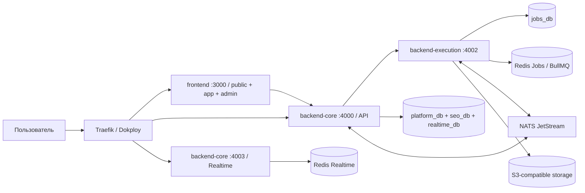

# Системная архитектура, репозиторий и Dokploy

## 1. Архитектурный стиль

Проект — модульный монорепозиторий с тремя application deployables: одним
frontend и двумя backend-компонентами. Process role не считается отдельным
микросервисом.

Основные правила:

- `backend-core` и `backend-execution` являются разными data/security
  ownership boundaries;
- прямой доступ одного backend-компонента к таблицам другого запрещён;
- вызовы Core-модулей выполняются in-process;
- синхронное межкомпонентное взаимодействие — versioned internal HTTP;
- durable события — transactional outbox/inbox + NATS JetStream;
- execution jobs — PostgreSQL source of truth + Redis/BullMQ transport;
- browser входит только через frontend/BFF и публичный Core API;
- новая deployable или data boundary требует ADR.

Решение о консолидации принято в ADR-2026-040 и ADR-2026-041.

## 2. Общая схема

PostgreSQL, Redis, NATS, S3 и ClamAV — инфраструктурные зависимости, а
migration/preflight containers — deploy steps, не прикладные сервисы.

## 3. Монорепозиторий

### 3.1. `frontend`

Один Next.js artifact содержит:

- public/localized marketing pages;
- индексируемый `/tools` и `/docs`;
- private/no-store `/app`;
- защищённый `/admin` для platform operations;
- same-origin BFF routes.

Маркетинговый контент текущей версии хранится типизированным source. Внешний
CMS не является runtime-зависимостью. Admin использует тот же session/API
boundary и design system, но отдельно проверяет platform role, recent auth и
high-risk confirmation.

Public, app и admin routes обязаны разделять caching/security policy. Tenant
responses не кэшируются, `/app` и `/admin` исключены из robots/sitemap и
получают `X-Robots-Tag: noindex`.

### 3.2. `backend-core`

Core владеет identity, workspace/project/RBAC, billing, audit, semantics,
pages, rank projections, crawl snapshots, notifications и realtime control
plane.

- `modules/api` — public API gateway и orchestration;
- `modules/seo` — SEO domain и тяжёлые read/projection models;
- `modules/realtime` — Socket.IO, notification/Web Push persistence;
- `src/core.main.ts` — Platform API + SEO composition;
- `src/realtime.main.ts` — Realtime process role;
- `src/web-push-worker.main.ts` — опциональная sender role;
- `src/main.ts` — supervisor.

Platform API обращается к SEO module через Fastify `inject`, не через TCP.
Порт 4001 временно сохраняет тот же internal HTTP contract для Execution.
До data cutover используются scoped Prisma clients для `platform_db`,
`seo_db`, `realtime_db`. Цель `app_db`/schemas не реализуется big-bang.

### 3.3. `backend-execution`

Execution владеет jobs, schedules, uploads/import staging, provider routing,
credential vault и execution receipts. Один artifact содержит HTTP, system,
import, inspection, rank, crawl, connector и auth-email roles; `src/main.ts`
управляет ими как child processes.

Каждая role получает отдельный environment allowlist. Connector использует
fixed login `jobs_connector`, не имеет direct table DML и вызывает только
exact `SECURITY DEFINER` broker functions. Queue payload содержит `jobId`, а
не provider credentials. Rank preparation не получает vault keyring;
connector не получает management/fingerprint keyring.

Если метрики докажут необходимость независимого scaling, отдельную role можно
запустить из того же artifact. Это не создаёт новый source service и требует
обновления ADR/topology.

### 3.4. Shared packages

- `packages/contracts` — OpenAPI/event/error types, identifiers и
  compatibility tests, без бизнес-логики;
- `packages/process-supervisor` — запуск child roles, signal forwarding и
  scoped environment construction.

### 3.5. `infrastructure`

Содержит Dokploy Compose, Dockerfiles, migrations/permissions orchestration,
Redis/NATS configuration, monitoring, security tests и runbooks. Каноническая
инструкция первого deploy — `infrastructure/DOKPLOY.md`.

## 4. Почему backend-компонентов два

1. Core — tenant control plane и authoritative application/SEO data.
2. Execution — durable work, provider I/O и credential security boundary.

Такое разделение изолирует внешние платные операции и credential vault, не
платя за сетевой hop между внутренними Core modules. Billing, SEO,
notifications, Realtime или отдельный connector выделяются в новый component
только при измеримой нагрузке, отдельном failure/security domain либо
независимой команде.

## 5. Владение данными

| Домен | Владелец | Compatibility database |
|---|---|---|
| users, sessions, workspace, RBAC, projects, billing | Core API | `platform_db` |
| semantics, pages, rankings, crawl projections | Core SEO | `seo_db` |
| realtime subscriptions/deliveries/event inbox | Core Realtime | `realtime_db` |
| jobs, schedules, credentials, provider execution | Execution | `jobs_db` |

Cross-database foreign keys запрещены. Межкомпонентные identifiers — UUIDv7.
Migration owners (`*_owner`) не передаются application runtime. Runtime roles
не имеют ownership, DDL, `TRUNCATE`, replication, membership или доступа к
чужой database. Grants применяются отдельным fail-closed deploy step.

## 6. Взаимодействия

### 6.1. Internal HTTP

Каждый route group использует отдельный caller/audience credential. Guards
принимают ровно одно значение заголовка и сравнивают timing-safe; clients
запрещают redirects и имеют bounded timeout. Retry допускается только для
идемпотентных операций.

Основные boundaries: Core → Execution commands/credentials, Execution → Core
SEO general/rank/result, Execution → Core rank grant/automation/email, Core ↔
Realtime notifications. Legacy общий `INTERNAL_API_TOKEN` запрещён.

### 6.2. NATS JetStream

Событие содержит version, event/trace IDs, occurredAt и tenant identifiers.
Producer пишет business change и outbox в одной PostgreSQL transaction.
Consumer дедуплицирует event ID, side effects идемпотентны, DLQ/replay
операционно наблюдаемы.

Publisher, consumer и topology provisioner используют разные NATS identities
и exact subject/API permissions. Application runtimes не получают право
изменять topology.

### 6.3. BullMQ

PostgreSQL Job, lease/checkpoint и terminal state authoritative. Redis/BullMQ
передаёт bounded work notification с минимальным payload. Jobs Redis
использует AOF/`noeviction` и queue-scoped named users.

## 7. Prisma и SQL

- у четырёх data modules отдельные Prisma schemas/migration histories;
- `prisma migrate deploy` выполняется one-shot owner role перед startup;
- runtime не получает owner password и `_prisma_migrations` access;
- обычный CRUD, relations и aggregates выполняются Prisma Client;
- `$queryRawUnsafe`/`$executeRawUnsafe` запрещены;
- `COPY`, locks/`SKIP LOCKED`, partitioning, triggers, specialized indexes и
  broker/permission functions остаются параметризованным SQL в узких
  repository/migration boundaries;
- применённые production migrations не редактируются, `db push` запрещён.

## 8. Cache и object storage

Production не использует Redis DB-number multiplexing:

- `redis-jobs` — durable BullMQ с разными ACL users;
- `redis-realtime` — ephemeral channel-only Socket.IO Pub/Sub.

Cache не является источником истины; key/channel содержит namespace/version и
ограничен TTL/ACL. Default user выключен, ACL рендерится в tmpfs без plaintext
password в config/argv.

S3-compatible storage private by default. Upload использует signed URL,
checksum, type/size validation и опциональный ClamAV inspection. Object key не
содержит неочищенное пользовательское имя. Jobs DB хранит logical object key;
production adapter добавляет неизменяемый deployment-level `S3_KEY_PREFIX` и
bucket-purpose segment (`uploads`/`artifacts`) только на storage boundary.

## 9. Dokploy

Compose project запускает три application services. Публичные routes:

- `frontend:3000` — основной домен;
- `backend-core:4000` — API domain;
- `backend-core:4003` — Realtime domain/path.

`backend-core:4001`, `backend-execution:4002` и data services internal-only.
Production и staging используют разные databases, buckets, Redis/NATS
credentials, OAuth apps и encryption keys.

При включённом inspection profile полный Compose содержит восемь long-running
containers и четырнадцать one-shot migration/permission/preflight containers.
PostgreSQL, Jobs Redis, NATS и ClamAV используют Docker named volumes;
repository configs запекаются в versioned images и не монтируются из
transient Dokploy checkout.

Deployment порядок: preflight → DB roles → migrations → exact grants/audit →
NATS topology → backend readiness → frontend. Rolling application rollback не
заменяет backup/forward plan для необратимой migration.

## 10. Надёжность и масштабирование

- supervisor останавливает container при завершении обязательной child role;
- SIGTERM передаётся children, long-running roles имеют graceful shutdown;
- readiness backend проверяет все обязательные listeners;
- bounded concurrency/backpressure задаются role-specific config;
- WebSocket восстанавливает authoritative state после reconnect;
- PostgreSQL backup хранится вне application host и регулярно проходит
  restore drill;
- четыре logical PostgreSQL databases получают отдельные S3 backup jobs и
  раздельные prefixes; live `postgres_data` volume snapshot не заменяет
  консистентный database dump/PITR;
- production observability включает structured logs, metrics, traces,
  queue/provider/DB saturation и synthetic critical journeys.

Начать допустимо на одном VPS, но production backup не должен зависеть от его
локального диска. Рост выполняется по измерениям: внешний S3, PostgreSQL
primary/replica, отдельные worker replicas, Redis HA и monitoring host.

## 11. Acceptance

- в source tree и Compose нет старых standalone application services;
- frontend, Core и Execution собираются независимо;
- child process env allowlists и DB/Redis/NATS boundaries проходят negative
  tests;
- Prisma validate/generate, typecheck, lint, tests и production build зелёные;
- migrations и ACL идемпотентны на PostgreSQL 18;
- login/session, tenant permission, manual Top-100, terminal job state,
  Realtime reconnect и degraded optional capabilities проходят smoke.
