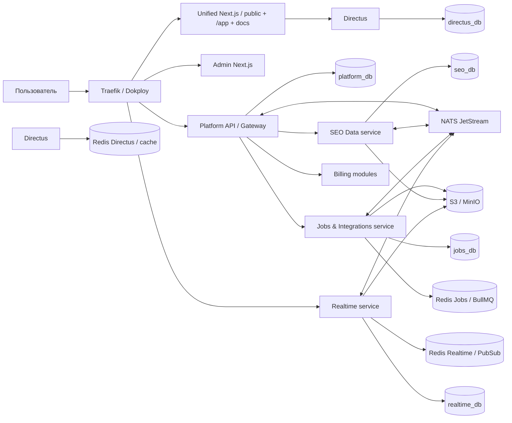

# Системная архитектура, репозитории и Dokploy

## 1. Архитектурный стиль

Целевая архитектура — ограниченный набор доменных микросервисов с отдельным владением данными. Не допускается дробление на сервис для каждой сущности.

Основные правила:

- сервис имеет бизнес-границу и владельца данных;
- прямой доступ одного сервиса к таблицам другого запрещён;
- синхронное взаимодействие — HTTP/gRPC через внутреннюю сеть;
- асинхронное — NATS JetStream;
- jobs — BullMQ/Redis;
- согласованность между сервисами — eventual consistency;
- финансовые и критические изменения используют outbox/inbox;
- публичный трафик проходит через API gateway.

## 2. Общая схема

## 3. Репозитории

Канонический исходный код хранится в одном GitHub monorepo. Каталоги ниже
являются package, deployable и data-ownership boundaries, а не вложенными
Git-репозиториями или submodules. Существовавшие до консолидации истории
импортированы без squash; решение и обратный путь через `git subtree split`
зафиксированы в `ADR-2026-037`.

Общий репозиторий не разрешает прямые межсервисные импорты доменной логики,
доступ к чужой БД или совместные migrations. Независимая сборка и
масштабирование процессов сохраняются.

### 3.1. `platform-web`

- единый Next.js web-продукт;
- публичный сайт, статьи и локализованные SEO-страницы;
- индексируемый `/tools` и временные noindex tool results;
- `/docs` и generated `/docs/api`;
- защищённое приложение в `/app`;
- Directus SDK только в public/docs server boundary;
- design system package;
- TanStack Query/Table/Virtual;
- ECharts;
- Tiptap;
- generated API client;
- Socket.IO/Hocuspocus clients;
- Playwright.

Route groups обязаны изолировать caching и data access:

- `app/(public)` — cacheable/ISR страницы без tenant data;
- `app/tools` — индексируемый каталог и public tool UI;
- `app/docs` — документация;
- `app/app` — authenticated, private/no-store;
- server-only Directus client не импортируется в client bundles;
- project Toolbox и public Toolbox используют общий generated API client и
  capability metadata, а не дублируют бизнес-логику.

На старте это один deployable. При росте одно и то же image может запускаться
двумя runtime profiles за path-based routing (`public` и `app`), чтобы всплеск
SEO-трафика или anonymous Toolbox не снижал доступность `/app`. Кодовая база,
домен и release artifact при этом остаются общими.

### 3.2. `platform-admin`

- Next.js internal admin;
- отдельный auth audience;
- generated admin API client;
- high-risk action confirmation;
- audit views.

### 3.3. `platform-api`

NestJS:

- public API gateway/BFF;
- auth and sessions;
- accounts;
- workspaces;
- roles/access;
- projects;
- billing and plans;
- support/admin API;
- audit;
- API keys/webhooks registry;
- authoritative rank execution grant issuer и immutable decision receipts;
- public Toolbox orchestration и anonymous entitlement;
- orchestration to other services.

Database: `platform_db`.

### 3.4. `platform-seo-data`

NestJS:

- semantics;
- groups/clusters/tags;
- custom columns;
- pages;
- competitors;
- positions/read models;
- SERP parsed data;
- analytics aggregates;
- issues;
- Radar page snapshots/diffs и sitemap models;
- Magnet staging/read models;
- versioning;
- heavy domain queries.

Database: `seo_db`.

### 3.5. `platform-jobs-integrations`

NestJS monorepo/repository с несколькими entrypoints:

- job API;
- credential management/validation command API;
- scheduler;
- import/export worker;
- immutable rank manifest preparation/recovery worker;
- ranking/SERP worker;
- frequency worker;
- competitor worker;
- crawl worker;
- Radar scheduler/polite crawl worker;
- sitemap generation worker;
- Magnet sync worker;
- public Toolbox low-priority worker profile;
- report worker;
- connector registry;
- credential validation connector worker;
- credential broker client;
- usage metering.

Database: `jobs_db`; Redis/BullMQ; S3.

Workers развёртываются независимо из одного репозитория и одного или нескольких image targets.

В текущем срезе `src/main.ts` запускается с credential role `MANAGEMENT`, а
`src/connector-worker.main.ts` — с role `EXECUTION`. HTTP-процесс принимает
create/rotate/revoke/validation commands, но не обращается к provider;
connector worker не открывает входящий HTTP listener и не получает credential
API token или fingerprint keyring. Между ними передаётся только канонический
PostgreSQL Job и BullMQ payload с `jobId`. Connector worker использует отдельный
фиксированный PostgreSQL login `jobs_connector` с отдельным
`JOBS_CONNECTOR_DATABASE_PASSWORD`. Для этой non-owner role permission
component не выдаёт direct table/sequence DML и предоставляет только
`CONNECT`, schema `USAGE` и exact `EXECUTE` allowlist `SECURITY DEFINER`
broker/claim/authorize functions внутри `jobs_db`.
После jobs migration one-shot component `jobs-connector-db-permissions`
идемпотентно создаёт/ужесточает эту роль через
`postgres/permissions/jobs-connector.sql` и fail-closed отклоняет
привилегированную роль, membership или ownership объектов кластера; worker
стартует только после его успеха.
Provisioning выполняет cluster-wide direct-ACL audit, закрывает `PUBLIC`
schema/object/default privileges в `jobs_db`, а generated first-match HBA
разрешает canonical login только в `jobs_db` и до общих rules отклоняет
replication, соседние databases и stale family names. Для production target
environment всё равно обязательны проверка фактического HBA order, fresh
login smoke и TLS/source-CIDR при межхостовом соединении.
Management и execution подключаются к одному durable Jobs instance через
разные named Redis users. Jobs HTTP и каждый worker ограничены exact
versioned BullMQ key pattern своей очереди; connector не может читать или
изменять management/system/import/rank keys. Instance не публикует port,
использует AOF + `noeviction`, default user выключен.

Остальные entrypoints того же image также имеют явную process role и
fail-closed capability validation:

| Process | Разрешённые зависимости и credentials |
|---|---|
| Jobs HTTP | `jobs_db`, Redis, NATS, S3, SMTP, `PLATFORM_API_TO_JOBS_TOKEN`, `JOBS_TO_SEO_DATA_TOKEN`, credential-management token/keyrings |
| import worker | `jobs_db`, Redis, S3, SEO Data URL и `JOBS_TO_SEO_DATA_TOKEN` |
| inspection worker | `jobs_db`, Redis, S3 и malware scanner |
| system worker | Redis и bounded concurrency; DB и остальные capabilities запрещены |
| rank worker | `jobs_db`, Redis, dedicated manifest/grant tokens |
| connector worker | `jobs_connector`, Redis и execution KEK |

ConfigModule получает role явно для каждого Nest entrypoint, а system worker
использует отдельный Redis-only loader. Поэтому общий env anchor не может
безошибочно выдать worker-у NATS/S3/SMTP/service/vault secret: лишняя
capability останавливает startup. Rank и connector сохраняют более строгие
границы, описанные ниже.

`src/rank-worker.main.ts` является отдельным preparation/recovery process:
credential role `DISABLED`, только `jobs_db`, Redis, internal SEO Data URL и
выделенные `JOBS_TO_SEO_RANK_TOKEN` и
`JOBS_TO_PLATFORM_RANK_GRANT_TOKEN`, а для normalized ingest —
`JOBS_TO_SEO_RANK_RESULT_TOKEN`. Grant token также получает только
Platform API; generic Jobs HTTP и остальные worker processes его не получают.
Rank-worker не получает HTTP/internal/vault, NATS, S3, SMTP или provider
credentials, не публикует port и в текущем Dokploy Compose подключён только к
`internal` и отдельной `jobs-redis`. Его bounded grant client сохраняет intent/decision и атомарно
создаёт secret-free `CONSUMED/READY_TO_SUBMIT` scoped execution, а dispatcher
вызывает его по одному sealed chunk. Scoped claim/authorize/runtime SQL и
exact grants обслуживают isolated connector-worker под login
`jobs_connector`; Jobs owner/runtime login provider credential не получает.
Env изоляция сама по себе не заменяет DB grants.

### 3.6. `platform-realtime`

- NestJS Socket.IO gateway;
- Redis adapter только для namespace `/collaboration`, с versioned channel
  prefix и отдельным channel-only ACL; root namespace остаётся in-memory;
- presence;
- collaborative table signals;
- comments/notifications delivery;
- Hocuspocus/Yjs server;
- report live updates.

Database: `realtime_db`; Redis; S3.

### 3.7. `platform-contracts`

Отдельный versioned package внутри monorepo, готовый к публикации в package
registry:

- OpenAPI specs;
- AsyncAPI/event schemas;
- JSON Schema;
- generated TypeScript clients;
- error catalog;
- shared identifiers;
- compatibility tests.

Не содержит доменной бизнес-логики.

### 3.8. `platform-infrastructure`

- Dokploy Compose/Stack definitions;
- environment templates;
- Traefik settings;
- monitoring;
- backups;
- CI/CD workflows;
- runbooks;
- disaster recovery;
- migration orchestration.

`platform-marketing` и `platform-app` являются миграционными источниками до
завершения переноса в `platform-web`. Новая функциональность в них не
добавляется. История `platform-app` сохранена в общем Git graph после
верифицированной консолидации; каталог можно удалить только отдельным
решением после проверки переноса нужных артефактов.

## 4. Почему сервисов четыре

Backend ограничивается:

1. platform/API;
2. SEO data;
3. jobs/integrations;
4. realtime.

Этого достаточно для:

- независимого масштабирования workers;
- изоляции тяжёлых SEO-данных;
- отдельного real-time lifecycle;
- независимого core/billing;
- приемлемой сложности для небольшой команды.

Выделение billing, notifications или connector в отдельный сервис допускается только после появления независимой команды, нагрузки или требований безопасности.

## 5. Стек

### Runtime

- Node.js 24 LTS;
- TypeScript strict;
- pnpm;
- pinned lockfiles.

### Frontend

- Next.js Active LTS;
- React;
- TanStack Query;
- TanStack Table/Virtual;
- ECharts;
- Tiptap;
- i18n library;
- accessible UI primitives.
- один web repository для public/docs/tools и `/app`;
- route-level cache/security policies вместо двух расходящихся frontend.

### Backend

- NestJS;
- Fastify adapter;
- Prisma ORM;
- Prisma Migrate;
- OpenAPI;
- Socket.IO;
- Hocuspocus/Yjs.

### Data

- PostgreSQL 18.x;
- Redis;
- NATS JetStream;
- S3-compatible storage; рекомендуемый production-вариант первого этапа — Yandex Object Storage;
- MinIO допускается для local development и изолированных тестов, но не как единственная production/offsite копия;
- optional PgBouncer.

### Observability

- OpenTelemetry;
- Prometheus;
- Grafana;
- Loki;
- Grafana Alloy;
- Tempo подключается не позднее появления устойчивых межсервисных production flows;
- Uptime Kuma либо внешний независимый uptime check;
- Sentry-compatible error tracking.

## 6. Владение данными

| Домен | Владелец |
|---|---|
| пользователи, сессии, workspace, RBAC | platform-api |
| проекты как identity и настройки верхнего уровня | platform-api |
| semantic core, pages, rankings, competitors | seo-data |
| jobs, schedules, connectors, usage | jobs-integrations |
| comments, presence, Yjs metadata, notification policy, browser push devices, deliveries | realtime |
| subscriptions, ledger, plans | platform-api billing modules |
| CMS content | Directus |

В одном PostgreSQL cluster каждый backend использует две canonical LOGIN-role:
`platform_owner/platform_runtime`, `seo_owner/seo_runtime`,
`jobs_owner/jobs_runtime`, `realtime_owner/realtime_runtime`. Owner применяется
только одноразовым `prisma migrate deploy` и владеет database/schema/objects;
runtime не имеет ownership, membership, DDL, `TRUNCATE`, доступа к
`_prisma_migrations`, replication или чужим databases и получает только
необходимые CRUD/sequence/routine privileges после migrations. Cluster
bootstrap administrator не передаётся этим process types. Directus временно
использует явно ограниченную combined role `directus_runtime_owner`, потому
что применяет собственные schema migrations при старте; роль ограничена
только `directus_db` и разделяется после появления отдельного поддерживаемого
migration step.

Межсервисные IDs — UUIDv7. Внешняя ссылка не сопровождается DB foreign key между databases.

## 7. Синхронные вызовы

Допускаются для:

- authorization decision;
- чтения небольшой актуальной конфигурации;
- estimate;
- запуска команды;
- health/capabilities.

Правила:

- timeout;
- retry только идемпотентных calls;
- circuit breaker;
- correlation ID;
- service authentication;
- no long-running synchronous calls.

В текущей symmetric-token реализации legacy `INTERNAL_API_TOKEN` удалён и
его наличие отклоняется startup. General route groups используют отдельные
caller/audience credentials: `PLATFORM_API_TO_SEO_DATA_TOKEN` (Platform API →
SEO Data), `PLATFORM_API_TO_JOBS_TOKEN` (Platform API → Jobs HTTP),
`JOBS_TO_SEO_DATA_TOKEN` (Jobs HTTP/import → SEO Data) и
`PLATFORM_API_TO_REALTIME_TOKEN` (Platform API → Realtime). Vault, Web Push
device, rank manifest/result и rank grant credentials остаются отдельными.
Runtime отклоняет placeholders, unsafe/short/long и reused values, guard
принимает один exact header, а internal clients запрещают redirect. Это
промежуточный hardening до service JWT/mTLS, а не отказ от целевой identity.

## 8. Асинхронные события

События:

- immutable fact в прошедшем времени;
- event ID;
- event version;
- occurredAt;
- producer;
- trace ID;
- workspace/project IDs;
- payload schema.

Примеры:

- `WorkspaceCreated`;
- `ProjectArchived`;
- `SemanticImportCommitted`;
- `KeywordsChanged`;
- `JobCompleted`;
- `CredentialInvalidated`;
- `UsageRecorded`;
- `BalanceReservationFailed`;
- `ReportPublished`;
- `RoleChanged`.

## 9. Outbox/inbox

- Изменение domain data и outbox event выполняются в одной PostgreSQL transaction.
- Publisher отправляет событие в NATS и отмечает доставку.
- Consumer сохраняет inbox event ID до side effect.
- Доставка at-least-once.
- Consumers идемпотентны.
- DLQ и replay доступны operations.

Текущий repository slice применяет эти правила к одному exact событию
`identity.session-family.revoked.v1`:

- `IDENTITY_EVENTS` хранит только
  `{environment}.identity.session-family.revoked.v1`, file-backed, limits
  retention, bounded message/count/bytes/age и duplicate window;
- `DOMAIN_EVENTS_DLQ` хранит только
  `{environment}.dlq.realtime.identity.session-family.revoked.v1` с отдельной
  bounded retention;
- durable pull consumer `realtime_session_family_revoked_v1` использует
  explicit ack, deliver-all/instant replay, exact filter, `ack_wait=60s`,
  `max_ack_pending=1` и file-backed state;
- internal-only one-shot `nats-topology-provisioner` создаёт отсутствующие
  ресурсы до старта Platform API/Realtime, безопасно reconciles только
  allowlisted limits и fail-closed отклоняет unsafe topology drift;
- Platform API publisher, Realtime consumer, provisioner и generic NATS
  runtime имеют отдельные deny-by-default credentials с exact API/event/ack
  permissions. App runtimes не получают CREATE/UPDATE/DELETE topology rights.

Эта реализация не является общим publisher для остальных outbox event types.
Для каждого следующего event family нужны собственные subject allowlist,
consumer, retention/replay и operational alerts.

## 10. Prisma

- У каждого backend repository своя Prisma schema и migrations.
- `prisma migrate deploy` выполняется отдельным release step.
- Migration step подключается только canonical owner-ролью своего сервиса;
  application runtime не получает owner password.
- После migrations отдельный fail-closed permission step проверяет ownership,
  extension allowlist, `PUBLIC`/default ACL и выдаёт runtime exact
  least-privilege grants.
- Production migrations не запускаются автоматически каждым replica.
- Сгенерированные SQL migrations проверяются вручную.
- Partitioning, indexes, extensions, triggers и views добавляются custom SQL.
- `db push` запрещён в staging/production.
- Миграции, применённые в production, не редактируются.

## 11. Работа с большими данными

Prisma используется для:

- transactional CRUD;
- permissions metadata;
- конфигураций;
- обычных entity queries.

Raw SQL/driver используется для:

- PostgreSQL `COPY`;
- staging merge;
- partition management;
- materialized views;
- крупные analytics;
- bulk update;
- specialized indexes.

Raw SQL централизуется в repository classes, параметризуется и тестируется. Произвольный SQL в controllers запрещён.

## 12. Cache

Redis используется для:

- sessions auxiliary state/revocation;
- permission cache;
- query/result cache;
- rate limits;
- BullMQ;
- Socket.IO adapter;
- presence;
- distributed locks с ограниченным TTL.

Кеш не является источником истины. Каждый key имеет namespace, version и TTL.

Production Compose не использует общий Redis password/DB multiplexing:

- `redis-jobs` — AOF, `noeviction`, отдельный volume и шесть queue-scoped
  identities для HTTP/system/inspection/import/rank/connector;
- `redis-realtime` — ephemeral Pub/Sub, без key access, только exact
  `seo-platform:realtime:v1` Socket.IO channels;
- `redis-directus` — отдельный ephemeral LRU cache с namespace
  `seo-platform:directus:v1`.

Все три instance находятся в отдельных internal-only networks. Default user
выключен, health identity имеет только `PING`, password hashes атомарно
рендерятся в tmpfs перед запуском. Выбранный config также копируется в этот
owner-correct runtime tmpfs до privilege drop; source bind mount после этого
не требуется Redis process. Plaintext credentials не передаются в
`redis-server` argv и не записываются в ACL/config. Для write-heavy Jobs AOF
`maxmemory` должен оставлять container/host headroom на fragmentation и до
двукратного memory footprint во время rewrite; текущий single-VPS default —
`256 MiB` при cap `768 MiB`.

## 13. Object storage

Buckets/prefixes:

- imports;
- exports;
- raw-serp;
- reports;
- attachments;
- yjs-snapshots;
- backups.

Правила:

- private by default;
- signed URLs;
- encryption at rest;
- checksum;
- content type validation;
- lifecycle/retention;
- malware scanning;
- object key не содержит исходное имя пользователя без sanitization.

## 14. Dokploy environments

- local;
- development;
- staging;
- production.

Production и staging используют разные databases, buckets, Redis, NATS, OAuth apps и secrets.

## 15. Базовая VPS-топология

### Старт

VPS 1:

- Dokploy;
- Traefik;
- frontend;
- API/realtime.

VPS 2:

- workers;
- Redis;
- NATS.

VPS 3:

- PostgreSQL;
- object storage либо внешний S3;
- backups.

Допустимо начать с меньшего числа VPS, но PostgreSQL и backups не должны зависеть только от локального диска единственного application VPS.

### Рост

- отдельный build server;
- несколько application servers;
- отдельные worker pools;
- PostgreSQL primary/replica;
- Redis HA;
- внешний S3;
- отдельный monitoring server.

## 16. Dokploy deployment

- Каждый deployable component создаётся как Dokploy Application или Compose service.
- Публичные domains настраиваются через Dokploy/Traefik.
- Внутренние сервисы не публикуют host ports.
- Используются private/isolated networks.
- Jobs API и outbound-required workers используют isolated internal network
  и отдельную сеть без опубликованных портов для исходящих
  S3/SMTP/provider соединений; подключение к ней не должно давать входящий
  public route. Rank preparation worker остаётся только в `internal`.
- Credential connector принимает только versioned application allowlist
  provider origins; до high-assurance production outbound network
  дополнительно ограничивается host firewall или egress proxy.
- Browser push management использует отдельный Platform API → Realtime token.
  Realtime HTTP получает только VAPID public key, exact push endpoint origin
  allowlist и отдельные encryption/fingerprint keyrings; VAPID private key
  этому process, Platform API и Web не выдаётся.
- Web Push registration и delivery включаются раздельно. Текущий Compose
  передаёт `WEB_PUSH_REGISTRATION_ENABLED=false` по умолчанию и не содержит
  sender/VAPID private key.
- Images публикуются в private registry, например GHCR.
- Tag immutable: git SHA + release version.
- `latest` не используется для production deploy.
- Health checks обязательны.
- Graceful shutdown обязателен.
- Workers перестают брать новые jobs и завершают/чекпоинтят текущие.

## 17. CI/CD

На pull request:

- format;
- lint;
- TypeScript;
- unit;
- integration;
- schema validation;
- migration lint;
- container build;
- dependency/security scan.

На staging:

- deploy migrations;
- deploy services;
- smoke;
- contract tests;
- E2E;
- visual tests.

На production:

- approval;
- backup check;
- expand-compatible migrations;
- rolling deploy;
- smoke;
- monitoring;
- rollback application if needed.

## 18. Миграционная совместимость

Используется expand/migrate/contract:

1. добавить совместимые columns/tables;
2. deploy code supporting old/new;
3. backfill;
4. переключить reads/writes;
5. удалить legacy позднее.

Breaking schema migration и deploy приложения одним необратимым шагом запрещены.

## 19. Availability

Цель:

- приложение/API 99,9% месячной доступности;
- jobs могут деградировать отдельно;
- outage одного provider не должен останавливать остальное приложение;
- CMS outage не должен немедленно отключать уже опубликованный сайт благодаря cache/static output.

## 20. Масштабирование

- API stateless;
- WebSocket replicas через Redis adapter;
- websocket-only transport либо sticky sessions;
- workers горизонтально по queue;
- concurrency настраивается;
- heavy reports/crawl изолированы;
- read replicas допускаются для аналитики;
- partition pruning обязательно для snapshots.

## 21. Конфигурация

- typed environment validation на startup;
- секреты не имеют defaults;
- public config отделён от server config;
- feature flags не заменяют permissions;
- environment variables документируются;
- runtime secrets не попадают в frontend bundles.

## 22. Архитектурные запреты

- shared database tables между сервисами;
- синхронная цепочка более трёх сервисов для пользовательского запроса;
- хранение API secrets в job payload/log;
- выполнение тяжёлой операции в HTTP request;
- бесконтрольные cron внутри каждого replica;
- production `prisma db push`;
- cross-service distributed transaction;
- использование Redis как единственного хранилища результата.
